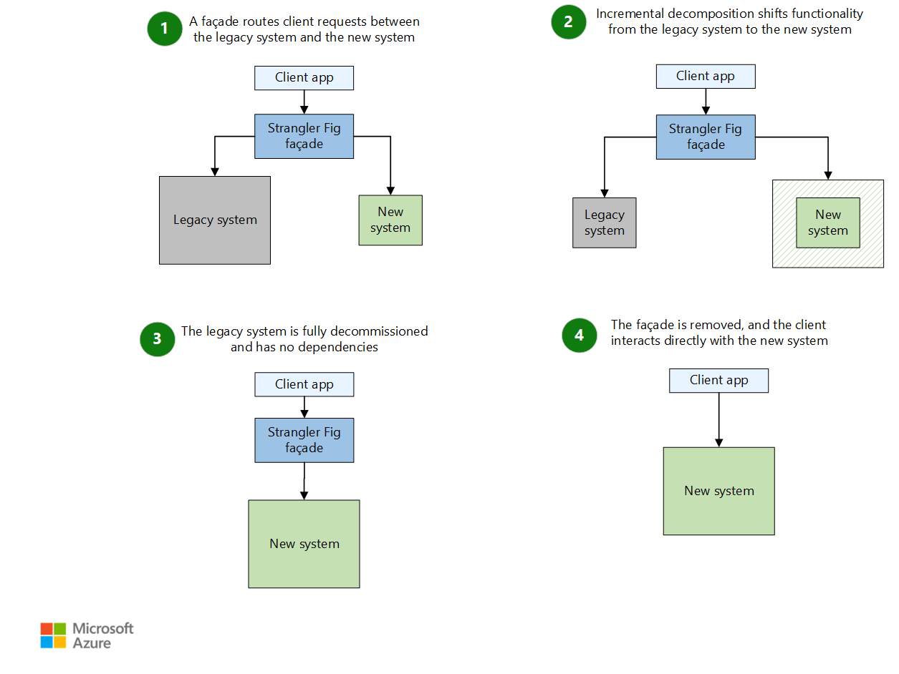

## Prerequisites & Preparation

Migrating from a monolith to microservices extends beyond technical implementation—it introduces significant organizational and operational challenges. Before embarking on this journey, evaluate whether distributed services are truly necessary. Consider splitting heavy components within your current application first.

**Key questions to ask:**

- Are you experiencing long deployment cycles that block rapid iteration?
- Do different components require independent scaling characteristics?
- Is team autonomy constrained by the monolithic codebase?
- Would distributed services solve real problems, or create unnecessary complexity?

**If microservices are the right path**, begin by defining clear service boundaries. Analyze your business capabilities to identify potential boundaries that align with business functions rather than technical layers. Start with services that have minimal or zero dependencies—such as email, authentication, or notifications—as these provide the safest entry point for migration.

## Migration Strategies (Strangler Fig)

The Strangler Fig pattern, popularized by Martin Fowler, offers a pragmatic approach to modernizing legacy systems. Rather than attempting a risky full rewrite, this pattern enables gradual replacement of functionality by intercepting requests and intelligently routing them to either existing or new components. Implementation typically begins with an interception layer—often an API gateway or proxy—that routes requests either to the monolith or to new microservices based on configurable rules.

This approach allows organizations to extract and replace functionality incrementally while maintaining a functioning system throughout the transition. It’s particularly effective for customer-facing applications where disruption must be minimized.

This pattern brings some considerations:

- After the migration is complete, you typically remove the strangler fig façade. - Alternatively, you can maintain the façade as an adaptor for legacy clients to use while you update the core system for newer clients.

- Make sure that the façade keeps up with the migration.

- Make sure that the façade doesn't become a single point of failure or a performance bottleneck.

## Database Migration & Synchronization

Database migration is often the most challenging aspect of transitioning from a monolith to microservices. A fundamental principle of microservices architecture is that each service should own its data—shared databases create tight coupling and defeat the purpose of independent services.

**Key considerations:**

- **Data ownership**: Each microservice must have its own database. A centralized database shared across services reintroduces the coupling you're trying to eliminate.
- **Migration strategy**: Define clear requirements for data migration upfront. This helps you choose the right approach and maintain flexibility during the transition.
- **Synchronization approach**: Determine how data will be synchronized between the legacy system and new microservices during the migration period.

**Common migration patterns:**

- **ETL (Extract, Transform, Load)**: Migrate historical data from the legacy database to new service databases using batch processing.
- **Shadow writes**: During the transition, the new system writes to both the new database and the legacy database in parallel. This allows you to validate data consistency without affecting the production system.
